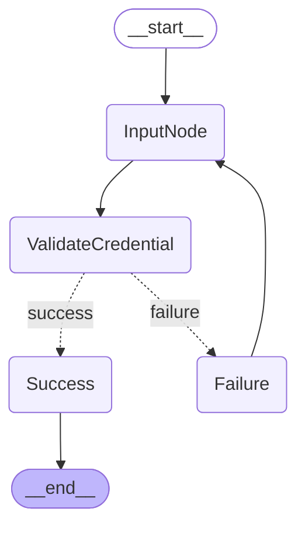
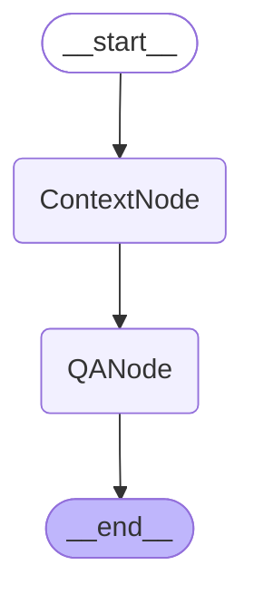
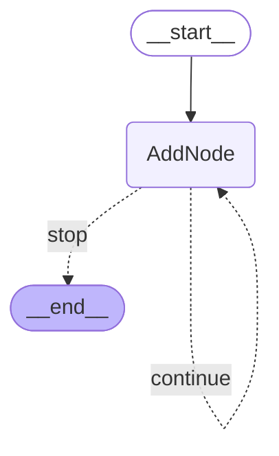

# Course 7 — Lab 27: LangGraph 101: Building Stateful AI Workflows (V2 — Onion-Architected)

> Code: [`course7-module1-lab1-v2-onion/`](course7-module1-lab1-v2-onion/)

V1's three canonical workflows restructured into strict onion architecture. Two LLM provider concretes (Ollama, OpenAI). Graph builders are pure application orchestration. The container is the only file that crosses layers. The entry point is one `demo.py` with argparse dispatch. 116 tests pass. Pyright clean on defaults, no `cast`, no `# type: ignore`.

Built as part of the IBM RAG and Agentic AI Professional Certificate — Course 7, Module 1, second commit in the Lab 27 sequence. V1 (canonical-faithful) is in the sibling `course7-module1-lab1-v1-canonical/`; V3 (event-sourced layer) follows in its own session.

---

## What It Does

Same three workflows as V1, restructured into the onion shape:

- **Auth** — five nodes (`InputNode`, `ValidateCredential`, `Success`, `Failure`, plus the conditional router), conditional + loop topology. The input node is produced by a factory closing over an `InputProviderInterface`. The verdict and message live inside the `AuthCredentials` domain object with a `__post_init__` invariant linking `is_authenticated=True` to a non-empty username.
- **QA** — two nodes (`ContextNode`, `QANode`), linear topology. V1's `InputValidationNode` is gone — `QAExchange.__post_init__` enforces the non-empty-question invariant at the domain layer, so the graph never sees an invalid exchange.
- **Counter** — one node (`AddNode`), cyclic + termination topology. V1's `PrintOutNode` is gone — observation is the streaming consumer's job. The router returns string literals (`"continue"`, `"stop"`) paired with a `dict[str, str]` path_map.

Three different topologies behind the same primitives, exactly as V1. The architectural moves change the code shape, not the workflow semantics.

---

## Stack

| Component             | Implementation                                                     |
| --------------------- | ------------------------------------------------------------------ |
| LLM providers         | `langchain-ollama==1.1.0`, `langchain-openai==1.3.2` behind `ChatModelProviderInterface` |
| Default provider      | `OllamaChatModelProvider(model_name="llama3.2:latest", temperature=0.0)` |
| Graph runtime         | `langgraph==1.2.5`                                                 |
| LangChain core        | `langchain==1.3.10`, `langchain-core==1.4.8`                       |
| State schema          | `TypedDict(total=False)` carrying one domain object per workflow   |
| Domain layer          | Three frozen dataclasses with `__post_init__` invariants           |
| Provider DI           | Optional override on `initialise()`; tests inject `MagicMock(spec=...)` |
| Input                 | `InputProviderInterface` — `ConsoleInputProvider` (stdin) or `ScriptedInputProvider` (canned) |
| Observation           | `StreamConsumerInterface` — `ConsoleStreamConsumer` driven by `graph.stream(stream_mode=["updates", "values"])` |
| Entry point           | `demo.py` with argparse subcommands (`auth`, `qa`, `counter`, `all`) |
| Architecture          | Strict onion — domain ← interfaces ← infra/application ← entry point |
| Type checker          | `pyright==1.1.402`, defaults, fully green, no `cast`, no `# type: ignore` |
| Test surface          | 116 tests, no API key required, sub-3-second runtime               |

---

## Setup

```powershell
python -m venv venv
.\venv\Scripts\Activate.ps1
pip install -r requirements.txt
ollama pull llama3.2:latest   # if not already local
ollama serve                  # or run the Ollama app
```

Run each workflow:

```powershell
python demo.py auth      # interactive — uses ConsoleInputProvider
python demo.py qa        # runs the three canned questions
python demo.py counter   # runs the 13-iteration cycle
python demo.py all       # all three back-to-back; Auth uses ScriptedInputProvider
```

Provider selection (OpenAI requires `OPENAI_API_KEY`):

```powershell
$env:OPENAI_API_KEY = "sk-..."
python demo.py qa --provider openai
```

Tests and pyright run without external dependencies:

```powershell
pytest                            # 116 tests, no API key needed
pyright                           # 0 errors
python scripts/draw_graphs.py     # emits Mermaid diagrams to docs/graphs/
```

---

## File Layout

```
course7-module1-lab1-v2-onion/
├── demo.py                                       # entry point — argparse dispatch
├── requirements.txt
├── pytest.ini
├── conftest.py
├── how-to-run.md
│
├── domain/                                       # pure value objects, no imports out
│   ├── auth_credentials.py                       # AuthCredentials + invariant
│   ├── qa_exchange.py                            # QAExchange + invariant
│   ├── counter_tick.py                           # CounterTick + invariant
│   └── state_schemas.py                          # AuthState, QAState, CounterState TypedDicts
│
├── interfaces/                                   # Protocols infra/application satisfy
│   ├── chat_model_provider_interface.py
│   ├── input_provider_interface.py
│   └── stream_consumer_interface.py
│
├── infra/                                        # I/O-touching concretes
│   ├── ollama_chat_model_provider.py
│   ├── openai_chat_model_provider.py
│   ├── console_input_provider.py
│   └── console_stream_consumer.py
│
├── application/                                  # orchestration via interfaces
│   ├── llm_text.py                               # invoke_text — narrowing helper
│   ├── auth_nodes.py
│   ├── qa_nodes.py
│   ├── counter_nodes.py
│   ├── routers.py
│   ├── graph_builders.py
│   ├── auth_agent_service.py
│   ├── qa_agent_service.py
│   ├── counter_agent_service.py
│   ├── container.py                              # composition root — only file crossing layers
│   ├── lab_app.py                                # frozen dataclass bundling the three services
│   ├── scripted_input_provider.py                # pure-logic concrete, no I/O
│   └── interfaces/
│       ├── auth_agent_service_interface.py
│       ├── qa_agent_service_interface.py
│       └── counter_agent_service_interface.py
│
├── scripts/
│   └── draw_graphs.py                            # emits Mermaid diagrams per commit
│
├── docs/
│   └── graphs/
│       ├── auth.mmd
│       ├── qa.mmd
│       └── counter.mmd
│
└── tests/                                        # mirrors source layout
    ├── domain/...
    ├── infra/...
    ├── application/...
    ├── scripts/test_draw_graphs.py
    └── test_demo.py
```

`ScriptedInputProvider` lives in `application/`, not `infra/`. The dividing line between application and infra is whether the concrete *talks to something outside the process*. `ScriptedInputProvider` is a canned-list iterator with no I/O — it stays in application alongside the other orchestration code. `ConsoleInputProvider` wraps `input()` and reads from stdin, so it lives in infra. The interface itself stays at root `interfaces/` because it has competing concretes across layers.

---

## Key Concepts

### State as a Single Domain Object Field

V1's `AuthState(TypedDict, total=False)` held four loose primitives — `username`, `password`, `is_authenticated`, `output`. Nothing prevented a state where `is_authenticated` was `True` with no username. V2 collapses the four primitives into a single `AuthCredentials` frozen dataclass with `__post_init__` enforcing "is_authenticated=True implies non-empty username":

```python
@dataclass(frozen=True)
class AuthCredentials:
    username: str | None = None
    password: str | None = None
    is_authenticated: bool | None = None
    message: str | None = None

    def __post_init__(self) -> None:
        if self.is_authenticated is True:
            if self.username is None or self.username == "":
                raise ValueError(
                    "AuthCredentials with is_authenticated=True requires a non-empty username"
                )
```

The `TypedDict` carries one field — the credentials object:

```python
class AuthState(TypedDict, total=False):
    credentials: AuthCredentials
```

V1's loose-bag pattern (where `input_validation_node` returned `{"valid": False, "error": ...}` keys that weren't declared on the `TypedDict`) is closed. The `TypedDict` declares exactly one key; that key holds an invariant-enforcing domain object. Nodes use `dataclasses.replace()` to update the object and return `{"credentials": new_object}`. The framework's last-write-wins merge keeps the contract intact.

`QAExchange` and `CounterTick` follow the same shape. `QAExchange` enforces "question is non-empty after strip", which lets V2's QA graph drop V1's `input_validation_node` entirely — the domain layer makes the invalid state unrepresentable, so the graph never sees it. `CounterTick` enforces "n >= 1, letter is a single lowercase ASCII char", which means V2's `counter_stop_router` reads `tick.n >= 13` against a value object whose validity is structurally guaranteed.

### Two-Stage Narrowing at Framework Boundaries

LangGraph's `graph.stream(stream_mode=["updates", "values"])` yields `Iterator[tuple[str, Any]]`. Pyright can't narrow the chunk type from the mode string — the API surface is statically loose. Naive code that does `final_state: AuthState = chunk` trips pyright cleanly: a generic dict isn't structurally an `AuthState`.

V2's pattern is two-stage narrowing at the branch guard:

```python
for mode, chunk in self._graph.stream(
    initial_state or {},
    stream_mode=["updates", "values"],
):
    if mode == "updates" and isinstance(chunk, dict):
        for node_name, state_delta in chunk.items():
            self._consumer.on_update(node_name, state_delta)
    elif mode == "values" and isinstance(chunk, dict):
        candidate = chunk.get("credentials")
        if isinstance(candidate, AuthCredentials):
            final_credentials = candidate
```

Two `isinstance` guards do two different jobs. The first (`isinstance(chunk, dict)`) accepts that the API yields some kind of dict; without it, pyright refuses `.items()` or `.get(...)` access. The second (`isinstance(candidate, AuthCredentials)`) verifies the specific key holds an instance of the domain type expected.

The fiction not maintained: "this chunk IS an AuthState". A `TypedDict` is a structural hint, not a runtime contract — the chunk from the API could have any keys with any values. V2 extracts the specific domain object it wants, narrows it with `isinstance` against the real contract (the domain type), and assigns that to a `DomainObject | None` variable pyright accepts cleanly. V3's event-translating consumer will narrow the same way per event type.

### One Narrowing Helper at the Application Boundary

V1's QA node inlined the `BaseMessage.content` narrowing — `if not isinstance(response.content, str): raise TypeError(...)` inside `llm_qa_node`. V2 moves the narrowing to a single application-layer helper used by every node that calls an LLM:

```python
# application/llm_text.py
def invoke_text(model: BaseChatModel, prompt: str) -> str:
    response = model.invoke(prompt)
    if not isinstance(response.content, str):
        raise TypeError(
            f"Expected str content from text-only prompt, got "
            f"{type(response.content).__name__}"
        )
    return response.content.strip()
```

Nodes never see `BaseMessage.content`'s `str | list` union. They call `invoke_text(model, prompt)` and get a stripped `str` back. The narrowing exists in exactly one place. Closes V1 finding #4.

The helper lives in `application/`, not `infra/`, because the narrowing is application-layer logic. The provider seam returns `BaseChatModel` directly — the seam's job is construction, not invocation. Mirrors the Lab 26 SQL Agent shape.

### Provider DI Seam Without Tool-Calling

Two LLM provider concretes — Ollama (default, no API key) and OpenAI — sit behind one Protocol that returns `BaseChatModel`:

```python
class ChatModelProviderInterface(Protocol):
    def create(self) -> BaseChatModel: ...
```

The container picks the concrete based on two boolean parameters on `initialise()`:

```python
def initialise(
    chat_model_provider: ChatModelProviderInterface | None = None,
    input_provider: InputProviderInterface | None = None,
    stream_consumer: StreamConsumerInterface | None = None,
    use_openai: bool = False,
    use_scripted_auth_input: bool = False,
) -> LabApp:
    if chat_model_provider is None:
        if use_openai:
            chat_model_provider = OpenAIChatModelProvider()
        else:
            chat_model_provider = OllamaChatModelProvider()
    if input_provider is None:
        if use_scripted_auth_input:
            input_provider = ScriptedInputProvider(_SCRIPTED_AUTH_RESPONSES)
        else:
            input_provider = ConsoleInputProvider()
    ...
```

The two booleans select between concretes when no explicit instance is injected. Explicit injection wins — tests pass `MagicMock(spec=Interface)` and the booleans are ignored.

Adding a third provider (Anthropic, Gemini, anything else) promotes `use_openai: bool` to an enum at that point — the boolean shape is honest for two values, the enum becomes honest for three. Pre-emptive enumeration for a two-value selection is the over-engineering the Copilot review caught; see the Production Insights paragraph below.

The originally-planned fourth worked example (a minimal tool-calling agent firing `ToolCalled` events in V3) was dropped before the build started — Module 2 Lab 30 (ReAct) provides a real tool-calling agent with Tavily web search, the natural firing site. V2 demonstrates the provider seam through QA alone. Tool-binding extensions to the interface land in Lab 28-30's V2 commits, not here.

### Dual-Mode Streaming for Observation Without Re-Invocation

LangGraph supports passing a list as `stream_mode`. Each chunk yields a tuple of `(mode, payload)`. V2 subscribes to both `updates` and `values`:

```python
for mode, chunk in self._graph.stream(initial_state, stream_mode=["updates", "values"]):
    if mode == "updates" and isinstance(chunk, dict):
        for node_name, state_delta in chunk.items():
            self._consumer.on_update(node_name, state_delta)
    elif mode == "values" and isinstance(chunk, dict):
        # extract domain object from final state
```

`updates` feeds the `StreamConsumerInterface` — one entry per node execution, exactly the granularity V3's event store needs. `values` carries the accumulating full state so the service returns the final result without a second graph invocation. Same primitive, two readers.

V1's nodes printed inside their bodies. V2's nodes return cleanly and the streaming consumer handles output. Closes V1 finding #6. The streaming layer IS the event stream — same primitive that drives console output in V2 drives the event store in V3.

### Factory Closures for Input Dependency

LangGraph nodes have signature `(state) -> dict`. They can't take injected dependencies as arguments — the framework calls them with state alone. V2 uses factory closures to capture dependencies:

```python
def make_input_node(input_provider: InputProviderInterface):
    def input_node(state: AuthState) -> AuthState:
        current = state.get("credentials") or AuthCredentials()
        # ... uses input_provider.prompt(...)
    return input_node
```

The container calls each factory once when building the graph.

### Composition at the Entry Point, Not in Graphs

Three graphs stay separate. `demo.py` composes the integrated experience:

```python
def run_all(app: LabApp) -> None:
    run_auth(app)
    run_counter(app)
    run_qa(app)
```

Auth runs first as the integrated greeter. Its verdict is logged but does NOT gate the others. Counter and QA always run. `demo.py all` uses `ScriptedInputProvider` for the auth section so the integrated demo doesn't block on stdin. Single-workflow runs (`demo.py auth`) use `ConsoleInputProvider` — interactive.

---

## Layer Walkthrough — Auth, Failure-Then-Success

End-to-end trace of `demo.py auth` against the canonical credentials, with the wrong password first to exercise the loop. Layer tags show where each step lives.

```
demo.py main(["auth"])                                              [entry point]
  → initialise(input_provider=ConsoleInputProvider())               [container — only file crossing layers]
    → ChatModelProviderInterface ← OllamaChatModelProvider()        [infra wired to interface]
    → InputProviderInterface ← ConsoleInputProvider()               [infra wired to interface]
    → StreamConsumerInterface ← ConsoleStreamConsumer()             [infra wired to interface]
    → build_auth_graph(input_provider)                              [application]
      → make_input_node(input_provider) — closure                   [application factory]
    → AuthAgentService(graph, stream_consumer)                      [application]
    → LabApp(auth=..., qa=..., counter=...)                         [application]
  → run_auth(app)                                                   [entry point dispatch]
    → app.auth.run()                                                [via Protocol — entry point doesn't know AuthAgentService]
      → graph.stream({}, stream_mode=["updates", "values"])
        → InputNode                                                 [application node]
          → input_provider.prompt("What is your username? ")        [interface → infra ConsoleInputProvider]
          → "test_user"
          → input_provider.prompt("Enter your password: ")
          → "wrong"
          → returns {"credentials": AuthCredentials(username="test_user", password="wrong")}
        → stream_consumer.on_update("InputNode", state_delta)       [interface → infra]
        → ValidateCredential                                        [application node]
          → returns {"credentials": replace(current, is_authenticated=False)}
        → stream_consumer.on_update("ValidateCredential", state_delta)
        → auth_router(state) → "failure"                            [application router]
        → Failure                                                   [application node]
          → returns {"credentials": AuthCredentials(username=None, password=None, is_authenticated=False, message="Not Successful, please try again!")}
        → stream_consumer.on_update("Failure", state_delta)
        → add_edge("Failure", "InputNode") — V1's loop-back
        → InputNode (second pass)
          → state.get("credentials").username is None              [Failure cleared both fields]
          → input_provider.prompt("What is your username? ")
          → "test_user"
          → input_provider.prompt("Enter your password: ")
          → "secure_password"
          → returns {"credentials": AuthCredentials(username="test_user", password="secure_password")}
        → ValidateCredential
          → returns {"credentials": replace(current, is_authenticated=True)}
          → __post_init__ verifies invariant: username is non-empty ✓
        → auth_router(state) → "success"
        → Success                                                   [application node]
          → returns {"credentials": replace(current, message="Authentication successful! Welcome.")}
        → add_edge("Success", END)
    → returns final_credentials                                     [AuthCredentials object]
```

---

## Traces

### Auth — failure then success, run via `demo.py auth`

```
[Auth] ------------------------------------------------------------
Please authenticate to continue...

[InputNode] {'credentials': AuthCredentials(username='test_user', password='wrong', is_authenticated=None, message=None)}
[ValidateCredential] {'credentials': AuthCredentials(username='test_user', password='wrong', is_authenticated=False, message=None)}
[Failure] {'credentials': AuthCredentials(username=None, password=None, is_authenticated=False, message='Not Successful, please try again!')}
[InputNode] {'credentials': AuthCredentials(username='test_user', password='secure_password', is_authenticated=None, message=None)}
[ValidateCredential] {'credentials': AuthCredentials(username='test_user', password='secure_password', is_authenticated=True, message=None)}
[Success] {'credentials': AuthCredentials(username='test_user', password='secure_password', is_authenticated=True, message='Authentication successful! Welcome.')}

Result: Authentication successful! Welcome.
```

Each line is one streaming consumer update. The `[NodeName]` prefix is `ConsoleStreamConsumer`'s format. State deltas show the full credentials object at each transition — the domain object is what's logged, not loose primitives.


### Counter — same 13-iteration exit

13 calls to `AddNode`, each producing a fresh `CounterTick` with `n` incremented and a random lowercase letter. The router exits at `n >= 13`. The streaming consumer logs each tick.

---

## Graph Diagrams

Generated by `scripts/draw_graphs.py` and stay live. Run the script once per commit to keep them in sync.

### Auth



### QA



### Counter



---

## Production Insights

**Two-stage narrowing at framework boundaries is the production pattern, not `cast`.** LangGraph's `stream(stream_mode=list)` API returns `Iterator[tuple[str, Any]]` — pyright can't narrow the chunk type from the mode string. The temptation is to `cast(AuthState, chunk)` and move on. The structural fix is two `isinstance` guards: one against `dict` to satisfy pyright on `.items()` and `.get(...)` access, one against the domain type to verify the specific key holds what's expected. No `cast`, no `# type: ignore`, no fiction that the chunk-from-the-API IS a typed state. Same pattern applies to V3's event-translating consumer and to any future framework boundary where the SDK gives `Any`.

**Graphs stay separate; composition lives at the entry point.** The instinct to merge workflows into one graph for "integrated UX" was considered and rejected. Composition belongs in `demo.py` (an `if` statement, ten lines of conditional dispatch), not in graph edges. Future-you reading the Counter code shouldn't have to mentally strip away an auth wrapper to see the cyclic-termination pattern. Same principle scales: a multi-workflow agent system in production composes services at the orchestration layer, not in framework-specific edges.

**Unit tests pin contracts; manual demos prove composition.** A wrong-username-no-recovery bug in `failure_node` passed every unit test cleanly because each unit's contract was pinned faithfully — `failure_node` cleared the password (as designed), `InputNode` skipped the username prompt when one was present (as designed). The bug lived at the seam: a user who wrongly inputted their username had no path to correct it. The fix clears both fields in `failure_node` so the next loop iteration re-prompts for both. The downstream blast radius — `demo.py`'s scripted response list went from three entries to four — was caught the same way: by running the demo, not by running pytest. V3's event store unlocks the proper fix: assert on the recorded event log of a full run.

---

## What V2 Doesn't Cover (V2 → V3 Findings)

V3's substrate sits next to V2's, not on top of it.

- **Event sourcing.** Each `stream_mode="updates"` chunk is an event in semantic shape but isn't persisted. V3 adds an `AgentEventStoreInterface` with in-memory and SQLite concretes, a streaming-consumer translation layer that writes events on the way through, and two projections (`RunSummaryProjection` per-aggregate and `ThreadHistoryProjection` cross-aggregate).
- **Tool-calling events.** `ToolCalled` and `ToolReturned` event types are reserved in V3's schema but have no firing site in Lab 27. Lab 30 (ReAct) is the natural home — Tavily web search + clothing recommendation. Schema-versioned from day one so adding `mcp_server_name` later is a version bump, not a rewrite.
- **Checkpointer.** No `MemorySaver`, no `SqliteSaver`, no resumable runs, no time travel. V3 introduces the checkpointer alongside the event store via an `AgentCheckpointerInterface` — both backed by the same SQLite database.
- **Interrupts and HITL.** No `interrupt()` from inside nodes, no `Command(resume=...)`. The Module 1 close-out discipline rule ("HITL is a scoped exception, not a default") means V2's Auth workflow runs end-to-end without human approval. V3's interrupt node lands as a deliberate architectural move, not a default.
- **Per-service event translation.** Where V2's three services duplicate their streaming loops, V3 diverges per service. Each translates its node updates to its domain events. The duplication-vs-abstraction call in V2 tips the other way in V3 — translation is where the services genuinely diverge.
- **Production hardening flagged by review, deliberately deferred.** A second Copilot review pass against "is this production ready?" surfaced five gaps, all accurate, all out of scope for V2. The `ConsoleStreamConsumer` prints full state deltas including `AuthCredentials.password` to stdout — a `RedactingStreamConsumer` satisfying the same interface is V3's event-translating consumer's job. Credentials are hardcoded (`"test_user"` / `"secure_password"` in `validate_credentials_node`) — that's V1's IBM lab auth example preserved verbatim; changing it changes what the lab demonstrates. The `ConsoleInputProvider.prompt` uses `input()` rather than `getpass.getpass`, so passwords are echoed — a `prompt_secret` method on the interface lands cleaner in V3 alongside the sensitive-field policy the event store will need. The QA hallucination is preserved as the eval-pipeline argument. `qa_node`'s `except Exception` swallowing returns raw exception text into the user-facing answer — V3 catches specifically (`OllamaConnectionError`, `httpx.HTTPError`) and logs full exceptions while returning user-safe messages. All five are real production gaps; none of them teach V2's architectural argument. Pinned here so V3 picks them up rather than rediscovering.

---

## V2 → V3 Findings (Pinned for the Next Commit)

1. **Streaming consumer is the event source.** V3's `AgentEventStoreInterface` plugs into the same `stream_mode=["updates", "values"]` subscription. The streaming-consumer translation layer reads updates and appends events.
2. **Two-stage narrowing pattern transfers verbatim.** Event translation does the same two `isinstance` guards — first against `dict` to access the chunk, then against the specific event type the state delta corresponds to.
3. **Per-service event translation, not generic.** Each service's translation function maps its node updates to its domain events. Translation is where the services genuinely diverge; the V2 duplication was the right call at the time.
4. **`AgentTrace` from Labs 22-26 is replaced, not extended.** V3's event store is the production observability shape; the `AgentTrace` from the older labs stays in its archived labs. `agentic-lab.md` gets the new section after V3 ships.
5. **Schema-versioned events from day one.** Every event has a `schema_version` field. Adding `correlation_id` for Module 3's multi-agent work becomes a version bump, not a migration.
6. **In-memory store first, SQLite second.** Same DI pattern as the LLM providers — interface + two concretes + config branch in the container. Tests use the in-memory store; production uses SQLite at a configured path.
7. **Event log assertions catch composition bugs unit tests miss.** Two V2 bugs surfaced through manual demo runs — the wrong-username-no-recovery hole in `Failure`'s clearing semantics, and the downstream blast radius into `demo.py`'s scripted response list. Unit tests pinned each unit's contract correctly; neither test could see the composed flow. V3's event store unlocks assertions over the full event log of a run — "the event stream of `demo.py all` contains exactly one `LoginFailed` followed by one `LoginSucceeded`, with no `ScriptExhausted` event anywhere". Lab 28's lesson pool projection is structurally the same shape applied to a different question. Pin this as the V3 testing pattern: unit tests pin behaviour, event log assertions pin composition.

---

## Connection to Subsequent Labs

**Lab 28 (Module 2, Reflection).** The `messages` reducer (`Annotated[list, add_messages]`) lands as a state field. The state-as-single-domain-object discipline holds — `ReflectionState` carries one field, a list of messages with a reducer. The `HumanMessage`-as-feedback trick from IBM's lab translates cleanly into the application layer's prompt construction. The "external signal vs confidence stacking" framing from the Module 1 close-out applies — Reflexion's critic is an external-signal pattern (critic LLM output is the signal driving the loop), not confidence stacking on the generator LLM.

**Lab 29 (Tweet Reflection).** Same shape as Lab 28, possibly with a character-limit-aware termination. Domain extension only.

**Lab 30 (ReAct).** Tool factory pattern lands properly. The seam for tool-binding extends `ChatModelProviderInterface` — likely a `bind_tools(...)` method on the adapter, with the `OllamaChatModelProvider` and `OpenAIChatModelProvider` implementations returning a new adapter wrapping the tool-bound model. `ToolCalled` and `ToolReturned` events finally fire. The fourth-worked-example deferred from Lab 27 V2 lands here as a real tool-calling agent, not a contrived demonstration.

---

**Completed:** 23 June 2026